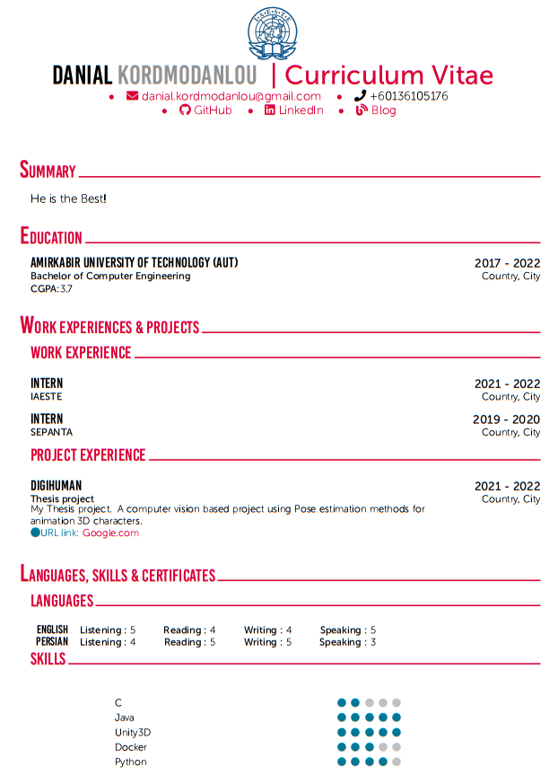

<div id="top"></div>
<!--

<!-- PROJECT SHIELDS -->
<!--
*** I'm using markdown "reference style" links for readability.
*** Reference links are enclosed in brackets [ ] instead of parentheses ( ).
*** See the bottom of this document for the declaration of the reference variables
*** for contributors-url, forks-url, etc. This is an optional, concise syntax you may use.
*** https://www.markdownguide.org/basic-syntax/#reference-style-links

[![Contributors][contributors-shield]][contributors-url]
[![Forks][forks-shield]][forks-url]
[![Stargazers][stars-shield]][stars-url]
[![Issues][issues-shield]][issues-url]
[![MIT License][license-shield]][license-url]
[![LinkedIn][linkedin-shield]][linkedin-url]

-->

<!-- PROJECT LOGO -->
<br />
<div align="center">


  <h3 align="center">Latex CV Builder</h3>

  <p align="center">
    Automative PDF CV builder using LaTex.
  </p>
</div>


<!-- ABOUT THE PROJECT -->
## About The Project

<!--[![Product Name Screen Shot][product-screenshot]](https://example.com)-->

Having a CV is required as it gives you a chance to show a prospective employer or professor the best of what you've got. [LaTex](https://www.latex-project.org/) is a fantastic typesetting program that a lot of people use these days for making an appropriate CV. However, making a CV is a time consuming action. <br />
This application will generate the Tex commnads, compile it and finally <b>generate PDF output in an automated way!</b><br />You only need to send a HTTP request to the application and add a Json data to the body of your request and the rest is with the application!  
 
<div align="center">
  
</div>

<!-- GETTING STARTED -->
## How to Use

Follow these steps to run the program.

### prerequirements

LaTex compiler should be installed on your device.<br />
1. Install LaTex by following the instruction at [this link](https://www.latex-project.org/get/)
2. Install JDK 11 using following command (for Unix users), Or simply visit the [Oracle website](https://www.oracle.com/java/technologies/downloads/archive/).
 ```sh
 sudo apt-get install openjdk-11-jdk
 ```


3. Install [Maven](https://maven.apache.org/install.html).
 ```sh
 sudo apt install maven
 ```

4. For testing the application having [Postman](https://www.postman.com/downloads/) installed is recommended.

### Usage


1. Clone the repository
   ```sh
   git clone https://github.com/your_username_/Project-Name.git
   ```
2. at the root of the application run the following command
   ```sh
   mvnw clean package
   ```
   or
   ```sh
   mvn clean package
   ```
3. Now a folder with the name of `target` is created. Copy `CVModel1` folder to `target` folder.
4. Go to the created `target` folder and run the application with the following command.
   ```sh
   java -jar CVBuilder-0.0.1-SNAPSHOT.jar
   ```
5. Open Postman application and create a GET request, in the URL part type `http://localhost:8080/pdfGenerator`.<br />
   Select `Body` choose `raw` option and use `JSON` instead of `Text`. Finaly pasete the Json template below and click Send.
   ```json
   {
    "summary":"He is the Best!",
    "name":"Danial",
    "familyName":"Kordmodanlou",
    "github":"github.com",
    "linkedin":"linkedin.com",
    "blog":"blog.com",
    "phoneNumber":"+60136105176",
    "emailAddress":"danial.kordmodanlou@gmail.com",
    "education":[{
    "institutionName": "Amirkabir University of Technology (AUT)",
    "degree": "Bachelor",
    "field": "Computer Engineering",
    "GPA": 3.7,
    "country": "Country",
    "city": "City",
    "entranceYear": "2017",
    "graduateYear": "2022"
    }],
    "workExperiences":[{
    "jobPosition": "Intern",
    "company": "IAESTE",
    "country": "Country",
    "city": "City",
    "startingYear": "2021",
    "finishingYear": "2022"
    },
    {
    "jobPosition": "Intern",
    "company": "SEPANTA",
    "country": "Country",
    "city": "City",
    "startingYear": "2019",
    "finishingYear": "2020"}],
    "projectExperiences":[{
    "title": "DigiHuman",
    "projectFor": "Thesis project",
    "country": "Country",
    "city": "City",
    "startingYear": "2021",
    "finishingYear": "2022",
    "linkURL": "Google.com",
    "description": "My Thesis project. A computer vision based project using Pose estimation methods for animation 3D characters." 
    },
    {
    "title": "DigiHuman",
    "projectFor": "Thesis project",
    "country": "Country",
    "city": "City",
    "startingYear": "2021",
    "finishingYear": "2022",
    "linkURL": "Google.com",
    "description": "My Thesis project. A computer vision based project using Pose estimation methods for animation 3D characters."
    }],
    "languages":[{
    "languageName": "English",
    "readingLevel": 3,
    "writingLevel": 5,
    "speakingLevel": 2,
    "listeningLevel": 1
    },
    {
    "languageName": "Persian",
    "readingLevel": 5,
    "writingLevel": 5,
    "speakingLevel": 2,
    "listeningLevel": 1
    }],
    "certificates":[{
    "title": "Coursera AI Course",
    "institute": "General Adverserial Networks (GANs)",
    "date": "2021" }],
    "publications":[{
    "title": "My Thesis",
    "releaseDate": "Jun 2020",
    "authors": "Danial k.",
    "publication": "Proceedings of the 2020 Artificial Intelligence Conference",
    "ISBN": "pp. 10--18" 
    }],
    "honors":[{
    "title": "Country RoboCup Competetion",
    "description": "Worked on Open Weight football-playing robots and became 4th amongst 32 competitors.",
    "date": "2015"
    }],
    "skills":[{
    "skillName": "C#",
    "level": 2
    },
    {
    "skillName": "Java",
    "level": 5
    }],
    "references":[{
    "name": "Dr. Who",
    "jobTitle": "Professor",
    "companyName": "Amirkabir University of Technology (AUT)",
    "phoneNumber":"+981234567",
    "emailAddress":"someone@gmail.com" 
    },
    {
    "name": "Dr. Who",
    "jobTitle": "Professor",
    "companyName": "Amirkabir University of Technology (AUT)",
    "phoneNumber":"+981234567",
    "emailAddress":"some@gmail.com"}],
    "QAs":[{
    "question": "Why did you chose IAESTE?",
    "answer": "Cause I have big dreams!"}
    ,{
    "question": "How did you get familiar with IAESTE?",
    "answer": "My friend who had experience with IAESTE internship encouraged me to attened IAESTE exam."
     }]}
    ```
6. After doing the last part you will receive a response declaring the place of your CV as Pdf file.

7. Enjoy!

<!-- USAGE EXAMPLES -->
## Use other CV templates

1. Place your CV template requirements (all fonts and .sty files) in a folder in the root of the application besides `CVModel1`
2. Create a new Java Class by inheriting `LatexCVGenerator` class.
3. Follow the same pattern like `AcademicCVType1` class.(exp: specify the Directory field with the name of the folder in step 1, add each section of your Tex file scheme in the overrided methods.
4. Finally use your custom class in the PdfGenerator method at `CvBuilderApplication` class.


